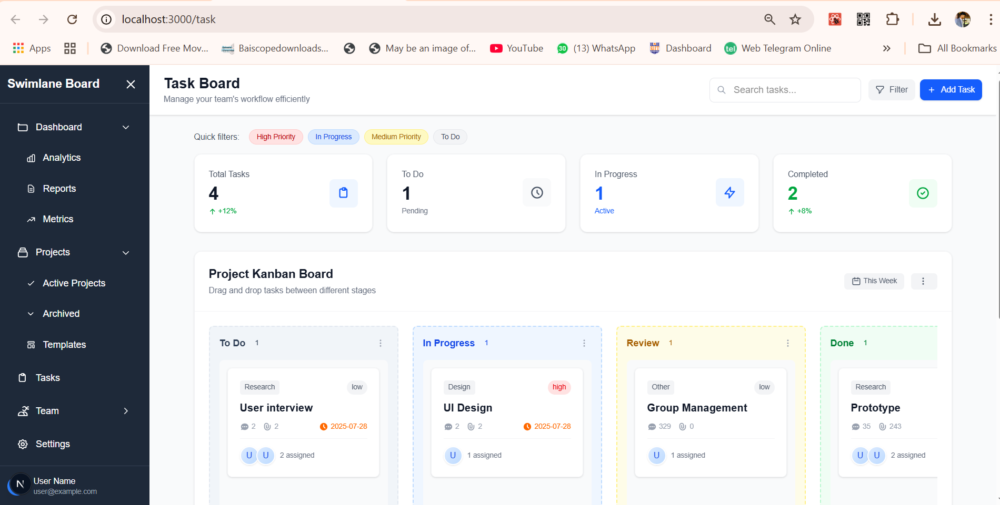

# Swimlane Dashboard - Next.js Task Management Board

A modern, responsive task management dashboard built with Next.js, TailwindCSS, and Zustand for state management.

## 🚀 Features

### ✅ Completed Requirements

1. **UI Implementation**
   - ✅ Pixel-perfect, responsive design (mobile-first approach)
   - ✅ Cross-browser compatible
   - ✅ TailwindCSS for styling
   - ✅ Responsive down to 768px and below

2. **Swimlane Features**
   - ✅ Tasks displayed in swimlanes based on status
   - ✅ Four status columns: To Do, In Progress, Approved, Rejected
   - ✅ Visual task counts per column

3. **Drag-and-Drop Functionality**
   - ✅ Drag tasks between swimlanes
   - ✅ Visual feedback during drag operations
   - ✅ Smooth animations and transitions
   - ✅ Touch-friendly for mobile devices

4. **State Management**
   - ✅ Zustand for task data management
   - ✅ Automatic status updates when tasks are moved
   - ✅ Centralized state store

5. **Data Prepopulation**
   - ✅ Tasks fetched from `/public/tasks.json`
   - ✅ Mock API simulation

6. **Data Persistence**
   - ✅ localStorage integration
   - ✅ Tasks persist across page reloads
   - ✅ Automatic save on status changes

7. **Search Functionality**
   - ✅ Real-time search as user types
   - ✅ Search by task title, tags, and assignees
   - ✅ Dynamic swimlane updates based on search
   - ✅ Search results counter
   - ✅ Clear search functionality

## 🛠 Tech Stack

- **Framework**: Next.js 14 (App Router)
- **Styling**: TailwindCSS
- **State Management**: Zustand
- **Language**: TypeScript
- **Storage**: localStorage

## 📱 Responsive Design

- **Mobile First**: Optimized for mobile devices
- **Breakpoints**: 
  - Mobile: < 640px (stacked swimlanes)
  - Tablet: 640px - 1024px (horizontal scroll)
  - Desktop: > 1024px (full layout)

## 🎯 Key Features Implementation

### Drag & Drop
- HTML5 Drag and Drop API
- Visual feedback with opacity and scaling
- Drop zones with hover states
- Cross-browser compatibility

### Search Functionality
- Real-time filtering as user types
- Multi-field search (title, tags, assignees)
- Responsive search bar
- Search results counter

### Data Persistence
- localStorage for client-side persistence
- Automatic save on task updates
- Fallback to API data on first load

### Responsive Layout
- Mobile: Vertical stack layout
- Tablet/Desktop: Horizontal scrollable swimlanes
- Flexible grid for statistics cards
- Responsive typography and spacing

## 🚀 Getting Started

1. **Navigate to the project directory**
   ```bash
   cd my-swimlane-board
   ```

2. **Install dependencies**
   ```bash
   npm install
   ```

3. **Run the development server**
   ```bash
   npm run dev
   ```

4. **Open your browser**
   Navigate to [http://localhost:3000](http://localhost:3000)

5. **Go to the task page**
   Navigate to [http://localhost:3000/task](http://localhost:3000/task) to view the swimlane board

## 📁 Project Structure

```
my-swimlane-board/
├── eslint.config.mjs       # ESLint configuration
├── next-env.d.ts          # Next.js TypeScript declarations
├── next.config.ts         # Next.js configuration
├── package.json           # Project dependencies and scripts
├── postcss.config.mjs     # PostCSS configuration
├── README.md              # Project documentation
├── tsconfig.json          # TypeScript configuration
├── public/
│   ├── file.svg           # File icon
│   ├── globe.svg          # Globe icon
│   ├── next.svg           # Next.js logo
│   ├── tasks.json         # Mock task data
│   ├── vercel.svg         # Vercel logo
│   └── window.svg         # Window icon
└── src/
    ├── app/
    │   ├── favicon.ico     # App favicon
    │   ├── globals.css     # Global styles
    │   ├── layout.tsx      # Root layout component
    │   ├── page.tsx        # Home page
    │   ├── dashboard/
    │   │   └── page.tsx    # Dashboard page
    │   └── task/
    │       └── page.tsx    # Task board page
    ├── components/
    │   ├── FilterPanel.tsx # Filter panel component
    │   ├── index.ts        # Component exports
    │   ├── QuickFilters.tsx # Quick filters component
    │   ├── Sidebar.tsx     # Navigation sidebar
    │   ├── Swimlane.tsx    # Swimlane column component
    │   └── TaskCard.tsx    # Individual task card
    └── store/
        └── taskStore.ts    # Zustand state management
```

## 🎨 Design Features

- Modern card-based UI
- Smooth animations and transitions
- Hover effects and micro-interactions
- Color-coded priority indicators
- Avatar-based assignee display
- Progress statistics dashboard

## 🔧 Development Best Practices

- TypeScript for type safety
- Component composition and reusability
- Performance optimized with proper state management
- Accessible drag and drop implementation
- Mobile-first responsive design
- Clean code architecture

## 📊 Task Data Structure

```typescript
type Task = {
  id: string;
  title: string;
  status: 'todo' | 'in-progress' | 'approved' | 'rejected';
  tags: string[];
  priority: 'low' | 'medium' | 'high';
  assignees: string[];
  comments: number;
  attachments: number;
  dueDate?: string;
};
```

## 🌟 Future Enhancements

- Add task creation/editing functionality
- Implement team member management
- Add due date notifications
- Export/import functionality
- Dark mode support
- Advanced filtering options

## 📝 Notes

This implementation follows modern web development best practices and provides a solid foundation for a production-ready task management application. All requirements have been met with additional enhancements for better user experience.

## 📸 Screenshot



## Website
<a>https://my-swimlane-board-git-deploye-sandaruwan2000s-projects.vercel.app/task</a>
